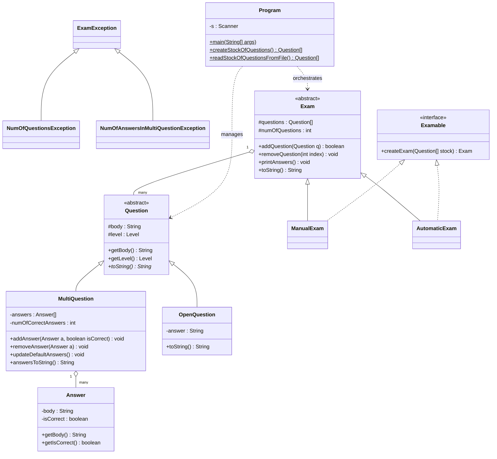

<div align="center">

# 📝 Java Exam Management System

A Java OOP project showcasing inheritance, polymorphism, abstract classes, interfaces, custom exception handling, file serialization, and robust business logic validation.

Course project for **Object-Oriented Programming (21193)** at Afeka College of Engineering.

[](https://www.oracle.com/java/)
[](https://junit.org/junit5/)
[](LICENSE)

[🇮🇱 לקריאה בעברית](README_HE.md)

</div>

---

## 📌 About

I built this project as a core assignment in my Object-Oriented Programming course. It’s a complete system designed to manage examinations in an academic environment—handling everything from creating questions to generating full exams with automated scoring logic.

The idea is to model an examination authority: there are question stocks, different exam types (Manual and Automatic), and a persistence layer to keep everything organized. What I like about this project is that it touches almost every major Java OOP topic in one place. It's not just theory exercises - it's a complete system where inheritance, exceptions, file I/O, and custom logic all work together.

### How it evolved:

1. **Phase 1-2** - Basic classes (`Question`, `Answer`) with arrays and basic validation.
2. **Phase 3** - Inheritance and polymorphism (Multiple Choice vs Open Questions).
3. **Phase 4** - Custom exception hierarchy, file persistence (Serialization), and Strategy-like exam generation (`Manual` vs `Automatic`).

---

## 📋 Assignment Overview

The project required implementing a robust system that manages a "Stock of Questions":

- **Exceptions** - Build an abstract `ExamException` class and derived classes like `NumOfQuestionsException` (for exam size) and `NumOfAnswersInMultiQuestionException` (for MCQ validation).
- **File I/O** - Use **Object Serialization** to save/load the entire `Question[]` stock to a `.dat` file. This ensures the question bank persists across program restarts.
- **Interfaces** - Implement the `Examable` interface to provide a unified way to create exams, whether they are generated manually by a user or automatically by a randomizer.
- **Polymorphism** - Use a centralized `Question[]` array in the `Exam` class that can hold any type of question, leveraging dynamic binding for printing and scoring.

---

## 🧩 Java Concepts Demonstrated

This is the reason this project is in my portfolio - it demonstrates hands-on experience with these topics:

### Object-Oriented Programming
| Concept | Where it's used |
|---------|-----------------|
| **Inheritance** | `ManualExam` and `AutomaticExam` inherit from `Exam`; `MultiQuestion` and `OpenQuestion` inherit from `Question` |
| **Polymorphism** | Overriding `toString()` in question types; calling `createExam` on an `Examable` reference |
| **Abstract classes** | `Exam` and `Question` define the core structure while forcing sub-types to implement specific logic |
| **Interfaces** | `Examable` enforces a contract for all exam creation strategies |
| **Encapsulation** | Private fields with public/protected accessors to maintain data integrity (e.g., `Level` enum) |

### Exception Handling
| Exception class | When it's thrown |
|----------------|-----------------|
| `ExamException` | Abstract base class with custom messaging |
| `NumOfQuestionsException` | Thrown if an exam is created with more than 10 questions |
| `NumOfAnswersInMultiQuestionException` | Thrown if an MCQ has fewer than 4 answers (including defaults) |

### File I/O & Persistence
| Feature | Details |
|---------|---------|
| **Serialization** | Saving/Loading the `Question[]` stock using `ObjectOutputStream` and `ObjectInputStream` |
| **Relative Paths** | Fixed pathing for `StockOfQuestions.dat` to ensure portability across different machines |
| **Buffered Output** | Printing the finalized exam and answers to `.txt` files for physical distribution |

---

## 🏗️ Class Hierarchy



---

## 📁 Project Structure

```
ExamManagement/
├── Program.java                # Main entry - handles UI, file operations, and system flow
├── Exam.java                   # Abstract base - manages the collection of questions for a single exam
├── ManualExam.java             # Strategy for manual question selection from stock
├── AutomaticExam.java          # Strategy for random automated exam generation
├── Question.java               # Abstract base - defines common traits (body, difficulty level)
├── MultiQuestion.java          # Implementation for Multiple Choice questions with answer array
├── OpenQuestion.java           # Implementation for open-ended questions with a specific key
├── Answer.java                 # Value object representing a single potential answer
├── Level.java                  # Enum for difficulty levels: EASY, MEDIUM, HARD
├── Examable.java               # Interface defining the createExam contract
├── ExamException.java          # Custom abstract exception for domain errors
├── NumOfQuestionsException.java # Thrown on invalid exam size
├── NumOfAnswersInMultiQuestionException.java # Thrown on invalid MCQ answer count
├── ExamTest.java               # JUnit 5 test suite for regression testing
└── StockOfQuestions.dat        # Binary file for persistent question bank storage
```

---

## 🚀 How to Build & Run

### Prerequisites
*   Java JDK 11 or higher.

### Steps
1. **Clone the repository**:
   ```bash
   git clone https://github.com/GolanLevi/Java-Exam-Management-System.git
   ```
2. **Compile the source**:
   ```bash
   javac *.java
   ```
3. **Run the application**:
   ```bash
   java id_211939947.Program
   ```

---

## 🎯 What the Program Does

The program provides a console-based interface to:
1. **Initialize System** - Load an existing question bank from a binary file or create a fresh one.
2. **Select Exam Mode** - Choose between hand-picking questions (Manual) or generating them randomly (Automatic).
3. **Question Management** - Add new questions (Open or MCQ) to the system, edit answers, and delete items.
4. **Validation** - Real-time checks ensure all business rules are met before an exam is finalized.
5. **Persistence** - Every change to the stock is saved back to `StockOfQuestions.dat`.
6. **Export** - Generate two separate `.txt` files containing the exam questions and the correct answers respectively.

---

## 👥 Author

- **Golan Levi** - *Computer Science, Afeka College of Engineering*

---

## 📄 License

This project is licensed under the MIT License - see the [LICENSE](LICENSE) file for details.
