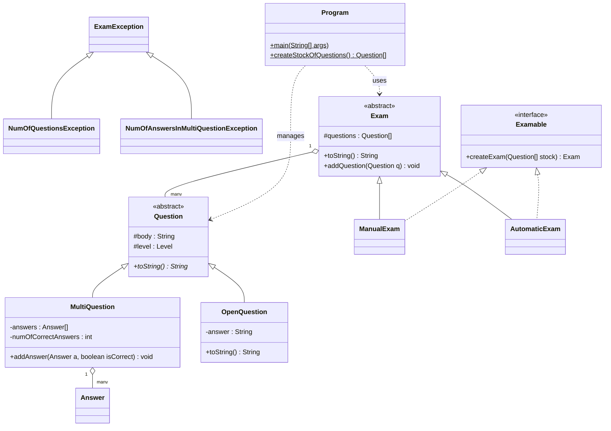

<div align="center">

# 🧠 Java Exam Management System

A Java OOP project showcasing inheritance, polymorphism, abstract classes, interfaces, custom exception handling, file serialization, and robust business logic validation.

Course project for **Object-Oriented Programming (21193)** at Afeka College of Engineering.

[](https://www.oracle.com/java/)
[](https://junit.org/junit5/)
[](LICENSE)

[🇮🇱 לקריאה בעברית](README_HE.md)

</div>

---

## 📌 About

I built this project as a core assignment in my Object-Oriented Programming course. It’s a complete system designed to manage examinations in an academic environment—handling everything from creating questions to generating full exams with automated scoring logic.

The idea is to model an examination authority: there are question stocks, different exam types (Manual and Automatic), and a persistence layer to keep everything organized. What I like about this project is that it moves beyond simple exercises into a functional application where inheritance, interfaces, and file serialization work together to create a persistent, scalable tool.

---

## 📋 Assignment Overview

The project required implementing a system that manages a "Stock of Questions" and generates exams based on it:

- **Inheritance & Hierarchy** - Support for multiple question types (Multiple Choice and Open) and exam generation strategies.
- **File I/O** - Ability to save and load the entire question bank to a `.dat` file using Java Serialization.
- **Business Logic** - Strict validation for multiple choice answers (minimum of 3, maximum of 10) and exam size constraints.
- **Exporting** - Generating professional formatted text files for the exam itself and a separate answer key.

---

## 🧩 Java Concepts Demonstrated

This is the reason this project is in my portfolio - it demonstrates hands-on experience with these topics:

### Object-Oriented Programming
| Concept | Where it's used |
|---------|-----------------|
| **Inheritance** | `ManualExam` and `AutomaticExam` inherit from `Exam`; `MultiQuestion` and `OpenQuestion` inherit from `Question` |
| **Polymorphism** | Dynamic binding in the `toString()` and `createExam()` methods across the hierarchy |
| **Abstract classes** | `Exam` and `Question` as base templates for all specific implementations |
| **Interfaces** | `Examable` interface defining the contract for exam creation |
| **Encapsulation** | Use of private members with protected/public accessors to ensure data integrity |

### Exception Handling
| Exception class | When it's thrown |
|----------------|-----------------|
| `ExamException` | Abstract base class for all domain-specific errors |
| `NumOfQuestionsException` | When the user attempts to create an exam with more than 10 questions |
| `NumOfAnswersInMultiQuestionException` | When a multiple-choice question has fewer than 4 answers |

### File I/O & Persistence
| Feature | Details |
|---------|---------|
| **Serialization** | Saving/Loading the entire `Question[]` stock using `ObjectOutputStream` and `ObjectInputStream` |
| **File Export** | Printing formatted exams and answer keys to `.txt` files with custom timestamps |
| **Path Portability** | Relative file path management for `StockOfQuestions.dat` to ensure the project runs anywhere |

---

## 🏗️ Class Hierarchy



---

## 📁 Project Structure

```
ExamManagement/
├── Program.java                # Main entry point and menu logic
├── Exam.java                   # Abstract base class for exams
├── ManualExam.java             # Manual exam generation logic
├── AutomaticExam.java          # Automatic random exam generation
├── Question.java               # Abstract base class for all questions
├── MultiQuestion.java          # Multiple choice question logic
├── OpenQuestion.java           # Open-ended question logic
├── Answer.java                 # Answer objects for multiple-choice questions
├── Examable.java               # Interface for exam creation
├── ExamException.java          # Base custom exception
├── NumOfQuestionsException.java # Validation error for exam size
├── NumOfAnswersInMultiQuestionException.java # Validation for MCQ answers
├── ExamTest.java               # JUnit 5 test cases
└── StockOfQuestions.dat        # Persistent data file (Generated on run)
```

---

## 🚀 How to Build & Run

### Prerequisites
*   Java JDK 11 or higher.

### Steps
1. **Clone the repository**:
   ```bash
   git clone https://github.com/GolanLevi/Java-Exam-Management-System.git
   ```
2. **Compile the source**:
   ```bash
   javac *.java
   ```
3. **Run the application**:
   ```bash
   java id_211939947.Program
   ```

---

## 🎯 What the Program Does

The program provides an interactive menu to:
1. **Manage Stock** - Create or load a persistent question bank.
2. **Generate Exams** - Build Manual or Automatic exams with runtime validation.
3. **Handle Exceptions** - Real-time feedback for business rule violations (e.g., trying to add too many questions).
4. **File Output** - Save the finalized exam and its solution key to separate text files.

---

## 👥 Author

- **Golan Levi** - *Computer Science, Afeka College of Engineering*

---

## 📄 License

This project is licensed under the MIT License - see the [LICENSE](LICENSE) file for details.
