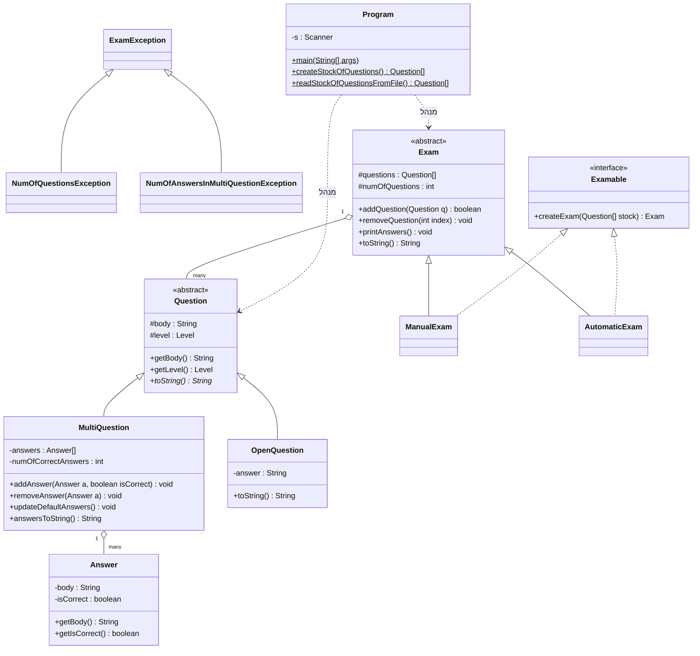

<div align="center">

# 🧠 מערכת ניהול מבחנים ב-Java

פרויקט Java מונחה עצמים המדגים שימוש בירושה, פולימורפיזם, מחלקות מופשטות, ממשקים (Interfaces), טיפול בחריגות מותאם אישית, סריאליזציה של קבצים ואימות לוגיקה עסקית.

פרויקט קורס **תכנות מונחה עצמים (21193)** - מכללת אפקה להנדסה.

[](https://www.oracle.com/java/)
[](https://junit.org/junit5/)
[](LICENSE)

[🇬🇧 Read in English](README.md)

</div>

---

<div dir="rtl">

## 📌 על הפרויקט

בניתי את הפרויקט הזה כחלק מרכזי בקורס תכנות מונחה עצמים. זוהי מערכת מלאה לניהול מבחנים בסביבה אקדמית - החל מיצירת מאגר שאלות ועד להפקת מבחנים מלאים עם לוגיקת ניקוד אוטומטית.

הרעיון הוא למדל רשות מבחנים: יש מאגר שאלות, סוגי מבחנים שונים (ידני ואוטומטי), ושכבת שמירת נתונים השומרת הכל מאורגן. מה שאני אוהב בפרויקט הזה הוא שהוא נוגע כמעט בכל נושא מרכזי ב-Java OOP במקום אחד. זה לא תרגילים תיאורטיים - זו מערכת שלמה שבה ירושה, חריגות, קבצים ולוגיקה מותאמת אישית עובדים יחד.

### איך הפרויקט התפתח:

1. **שלבים 1-2** - מחלקות בסיסיות (`Question`, `Answer`) עם מערכים ואימות נתונים בסיסי.
2. **שלב 3** - ירושה ופולימורפיזם (שאלות אמריקאיות מול שאלות פתוחות).
3. **שלב 4** - היררכיית חריגות מותאמת אישית, שמירת נתונים (Serialization), ואסטרטגיות יצירת מבחן (`Manual` מול `Automatic`).

---

## 📋 דרישות המטלה

הפרויקט דרש מימוש מערכת יציבה המנהלת "מאגר שאלות":

- **חריגות (Exceptions)** - בניית מחלקת `ExamException` מופשטת ומחלקות נגזרות כמו `NumOfQuestionsException` (לגודל המבחן) ו-`NumOfAnswersInMultiQuestionException` (לאימות שאלות אמריקאיות).
- **עבודה עם קבצים** - שימוש ב-**Object Serialization** לשמירה וטעינה של כל ה-`Question[] stock` לקובץ `.dat`. זה מבטיח שהמאגר נשמר גם לאחר סגירת התוכנית.
- **ממשקים (Interfaces)** - מימוש ממשק `Examable` כדי לספק דרך אחידה ליצירת מבחנים, בין אם הם נוצרים ידנית על ידי המשתמש ובין אם באופן אקראי.
- **פולימורפיזם** - שימוש במערך `Question[]` מרכזי במחלקת `Exam` שיכול להכיל כל סוג שאלה, תוך ניצול קישור דינמי להדפסה וניהול.

---

## 🧩 מה הפרויקט מדגים מבחינת Java

זו הסיבה שהפרויקט הזה נמצא בתיק העבודות שלי - הוא מדגים ניסיון מעשי בנושאים הבאים:

### תכנות מונחה עצמים (OOP)
| מושג | איפה זה בשימוש |
|---------|-----------------|
| **ירושה** | `ManualExam` ו-`AutomaticExam` יורשים מ-`Exam`; `MultiQuestion` ו-`OpenQuestion` יורשים מ-`Question` |
| **פולימורפיזם** | דריסת `toString()` בסוגי השאלות; קריאה ל-`createExam` על הפניה מסוג `Examable` |
| **מחלקות מופשטות** | `Exam` ו-`Question` מגדירות את מבנה הליבה ומכריחות תתי-סוגים לממש לוגיקה ספציפית |
| **ממשקים (Interfaces)** | `Examable` אוכף חוזה לכל אסטרטגיות יצירת המבחן |
| **כמוסה (Encapsulation)** | שדות פרטיים עם מתודות גישה להבטחת תקינות הנתונים (למשל Enum של רמות קושי) |

### טיפול בחריגות (Exceptions)
| מחלקת חריגה | מתי היא נזרקת |
|----------------|-----------------|
| `ExamException` | מחלקת בסיס מופשטת עם הודעות מותאמות |
| `NumOfQuestionsException` | נזרקת אם המשתמש מנסה ליצור מבחן עם יותר מ-10 שאלות |
| `NumOfAnswersInMultiQuestionException` | נזרקת אם לשאלה אמריקאית יש פחות מ-4 תשובות |

### עבודה עם קבצים ושמירת נתונים
| פיצ'ר | פרטים |
|---------|-----------------|
| **Serialization** | שמירה/טעינה של ה-`Question[]` באמצעות `ObjectOutputStream` ו-`ObjectInputStream` |
| **נתיבים יחסיים** | ניהול נתיבים גמיש ל-`StockOfQuestions.dat` להבטחת הרצה בכל מכונה |
| **פלט מעובד** | הדפסת המבחן המוגמר והתשובות לקבצי `.txt` עבור הפצה פיזית |

---

## 🏗️ היררכיית המחלקות



---

## 📁 מבנה הפרויקט

```
ExamManagement/
├── Program.java                # נקודת כניסה ראשית - מטפל ב-UI, פעולות קבצים וזרימת המערכת
├── Exam.java                   # בסיס מופשט - מנהל את אוסף השאלות למבחן בודד
├── ManualExam.java             # אסטרטגיה לבחירת שאלות ידנית מהמאגר
├── AutomaticExam.java          # אסטרטגיה ליצירת מבחן אקראי אוטומטי
├── Question.java               # בסיס מופשט - מגדיר תכונות משותפות (תוכן, רמת קושי)
├── MultiQuestion.java          # מימוש לשאלות אמריקאיות עם מערך תשובות
├── OpenQuestion.java           # מימוש לשאלות פתוחות עם תשובת מפתח
├── Answer.java                 # אובייקט המייצג תשובה פוטנציאלית בודדת
├── Level.java                  # Enum לרמות קושי: EASY, MEDIUM, HARD
├── Examable.java               # ממשק המגדיר את החוזה של createExam
├── ExamException.java          # חריגה מופשטת מותאמת לשגיאות דומיין
├── NumOfQuestionsException.java # נזרקת במקרה של גודל מבחן לא תקין
├── NumOfAnswersInMultiQuestionException.java # נזרקת במקרה של כמות תשובות לא תקינה
├── ExamTest.java               # חבילת בדיקות JUnit 5 לבדיקות רגרסיה
└── StockOfQuestions.dat        # קובץ בינארי לשמירה קבועה של מאגר השאלות
```

---

## 🚀 הרצה

### דרישות קדם
*   Java JDK 11 ומעלה.

### שלבים
1. **שכפול המאגר**:
   ```bash
   git clone https://github.com/GolanLevi/Java-Exam-Management-System.git
   ```
2. **קומפילציה**:
   ```bash
   javac *.java
   ```
3. **הרצה**:
   ```bash
   java id_211939947.Program
   ```

---

## 🎯 מה התוכנית עושה

התוכנית מספקת ממשק מבוסס קונסול המאפשר:
1. **אתחול מערכת** - טעינת מאגר קיים מקובץ בינארי או יצירת מאגר רענן.
2. **בחירת מצב מבחן** - בחירה בין בחירה ידנית של שאלות לבין יצירה אוטומטית.
3. **ניהול שאלות** - הוספת שאלות (פתוחות או אמריקאיות), עריכת תשובות ומחיקה.
4. **אימות (Validation)** - בדיקות בזמן אמת מבטיחות שכל הכללים העסקיים מתקיימים.
5. **שמירה קבועה** - כל שינוי במאגר נשמר באופן מיידי ל-`StockOfQuestions.dat`.
6. **ייצוא** - הפקת שני קבצי `.txt` נפרדים המכילים את שאלות המבחן ואת דף התשובות.

---

## 👥 כותב

- **גולן לוי** - *תלמיד מדעי המחשב, מכללת אפקה להנדסה*

---

## 📄 רישיון

פרויקט זה מופץ תחת רישיון MIT - ראו את קובץ [LICENSE](LICENSE) לפרטים.

</div>
