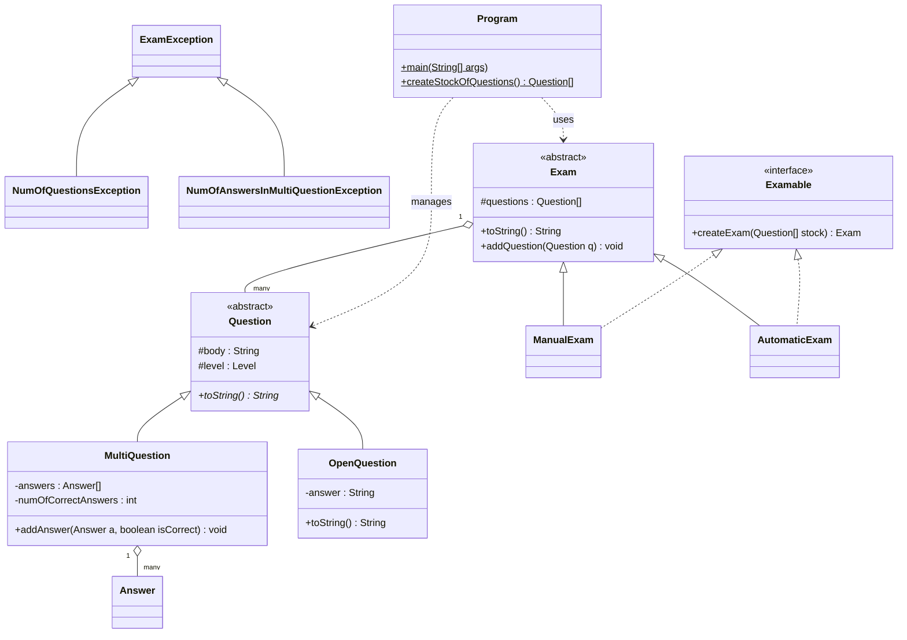

<div align="center">

# 🧠 מערכת ניהול מבחנים ב-Java

פרויקט Java מונחה עצמים המדגים שימוש בירושה, פולימורפיזם, מחלקות מופשטות, ממשקים (Interfaces), טיפול בחריגות מותאם אישית, סריאליזציה של קבצים ואימות לוגיקה עסקית.

פרויקט קורס **תכנות מונחה עצמים (21193)** - מכללת אפקה להנדסה.

[](https://www.oracle.com/java/)
[](https://junit.org/junit5/)
[](LICENSE)

[🇬🇧 Read in English](README.md)

</div>

---

<div dir="rtl">

## 📌 על הפרויקט

בניתי את הפרויקט הזה כחלק מרכזי בקורס תכנות מונחה עצמים. זוהי מערכת מלאה לניהול מבחנים בסביבה אקדמית - החל מיצירת מאגר שאלות ועד להפקת מבחנים מלאים עם לוגיקת ניקוד אוטומטית.

הרעיון הוא למדל רשות מבחנים: יש מאגר שאלות, סוגי מבחנים שונים (ידני ואוטומטי), ושכבת שמירת נתונים השומרת הכל מאורגן. מה שאני אוהב בפרויקט הזה הוא שהוא עובר מעבר לתרגילים פשוטים לאפליקציה פונקציונלית שבה ירושה, ממשקים וסריאליזציה של קבצים עובדים יחד ליצירת כלי יציב וניתן להרחבה. הקדשתי תשומת לב מיוחדת לטיפול בשגיאות כדי להבטיח שהמערכת תישאר יציבה גם עם קלט משתמש לא תקין.

---

## 📋 דרישות המטלה

הפרויקט דרש מימוש מערכת המנהלת "מאגר שאלות" ומפיקה ממנו מבחנים:

- **ירושה והיררכיה** - תמיכה בסוגי שאלות מרובים (רב-ברירה ופתוחה) ואסטרטגיות שונות ליצירת מבחן.
- **עבודה עם קבצים** - יכולת שמירה וטעינה של כל מאגר השאלות לקובץ `.dat` באמצעות Serialization של Java.
- **לוגיקה עסקית** - אימות קפדני של תשובות לשאלות אמריקאיות (מינימום 3, מקסימום 10) והגבלות על גודל המבחן.
- **ייצוא** - הפקת קבצי טקסט מעוצבים למבחן עצמו ולדף תשובות נפרד.

---

## 🧩 מה הפרויקט מדגים מבחינת Java

זו הסיבה שהפרויקט הזה נמצא בתיק העבודות שלי - הוא מדגים ניסיון מעשי בנושאים הבאים:

### תכנות מונחה עצמים (OOP)
| מושג | איפה זה בשימוש |
|---------|-----------------|
| **ירושה** | `ManualExam` ו-`AutomaticExam` יורשים מ-`Exam`; `MultiQuestion` ו-`OpenQuestion` יורשים מ-`Question` |
| **פולימורפיזם** | קישור דינמי במתודות `toString()` ו-`createExam()` לאורך ההיררכיה |
| **מחלקות מופשטות** | `Exam` ו-`Question` כבסיס לכל המימושים הספציפיים |
| **ממשקים (Interfaces)** | ממשק `Examable` המגדיר את החוזה ליצירת מבחנים |
| **כמוסה (Encapsulation)** | שימוש בחברים פרטיים עם גישה מבוקרת להבטחת תקינות הנתונים |

### טיפול בחריגות (Exceptions)
| מחלקת חריגה | מתי היא נזרקת |
|----------------|-----------------|
| `ExamException` | מחלקת בסיס מופשטת לכל שגיאות המערכת |
| `NumOfQuestionsException` | כאשר מנסים ליצור מבחן עם יותר מ-10 שאלות |
| `NumOfAnswersInMultiQuestionException` | כאשר לשאלה אמריקאית יש פחות מ-4 תשובות |

### עבודה עם קבצים ושמירת נתונים
| פיצ'ר | פרטים |
|---------|-----------------|
| **Serialization** | שמירה/טעינה של כל מערך השאלות באמצעות `ObjectOutputStream` ו-`ObjectInputStream` |
| **ייצוא קבצים** | הדפסת מבחנים ודפי תשובות לקבצי `.txt` עם חותמות זמן מותאמות |
| **ניידות נתיבים** | ניהול נתיב יחסי לקובץ `StockOfQuestions.dat` להבטחת הרצה בכל מחשב |

---

## 🏗️ היררכיית המחלקות



---

## 📁 מבנה הפרויקט

```
ExamManagement/
├── Program.java                # נקודת כניסה ראשית ולוגיקת תפריטים
├── Exam.java                   # מחלקת בסיס מופשטת למבחנים
├── ManualExam.java             # לוגיקת יצירת מבחן ידני
├── AutomaticExam.java          # יצירת מבחן אקראי אוטומטי
├── Question.java               # מחלקת בסיס מופשטת לכל השאלות
├── MultiQuestion.java          # לוגיקה לשאלות רב-ברירה
├── OpenQuestion.java           # לוגיקה לשאלות פתוחות
├── Answer.java                 # אובייקטים של תשובות לשאלות אמריקאיות
├── Examable.java               # ממשק ליצירת מבחן
├── ExamException.java          # חריגת בסיס מותאמת
├── NumOfQuestionsException.java # שגיאת אימות לגודל מבחן
├── NumOfAnswersInMultiQuestionException.java # אימות כמות תשובות
├── ExamTest.java               # מקרי בדיקה JUnit 5
└── StockOfQuestions.dat        # קובץ נתונים (נוצר בזמן הרצה)
```

---

## 🚀 הרצה

### דרישות קדם
*   Java JDK 11 ומעלה.

### שלבים
1. **שכפול המאגר**:
   ```bash
   git clone https://github.com/GolanLevi/Java-Exam-Management-System.git
   ```
2. **קומפילציה**:
   ```bash
   javac *.java
   ```
3. **הרצה**:
   ```bash
   java id_211939947.Program
   ```

---

## 🎯 מה התוכנית עושה

בזמן ההרצה, התוכנית מספקת תפריט אינטראקטיבי שמאפשר:
1. **ניהול מאגר** - יצירה או טעינה של מאגר שאלות קבוע.
2. **הפקת מבחנים** - בניית מבחנים ידניים או אוטומטיים עם אימות בזמן אמת.
3. **טיפול בחריגות** - קבלת משוב מיידי על הפרת כללים עסקיים (למשל ניסיון להוסיף יותר מדי שאלות).
4. **פלט לקבצים** - שמירת המבחן הסופי ודף התשובות לקבצי טקסט נפרדים.

---

## 👥 כותב

- **גולן לוי** - *תלמיד מדעי המחשב, מכללת אפקה להנדסה*

---

## 📄 רישיון

פרויקט זה מופץ תחת רישיון MIT - ראו את קובץ [LICENSE](LICENSE) לפרטים.

</div>
